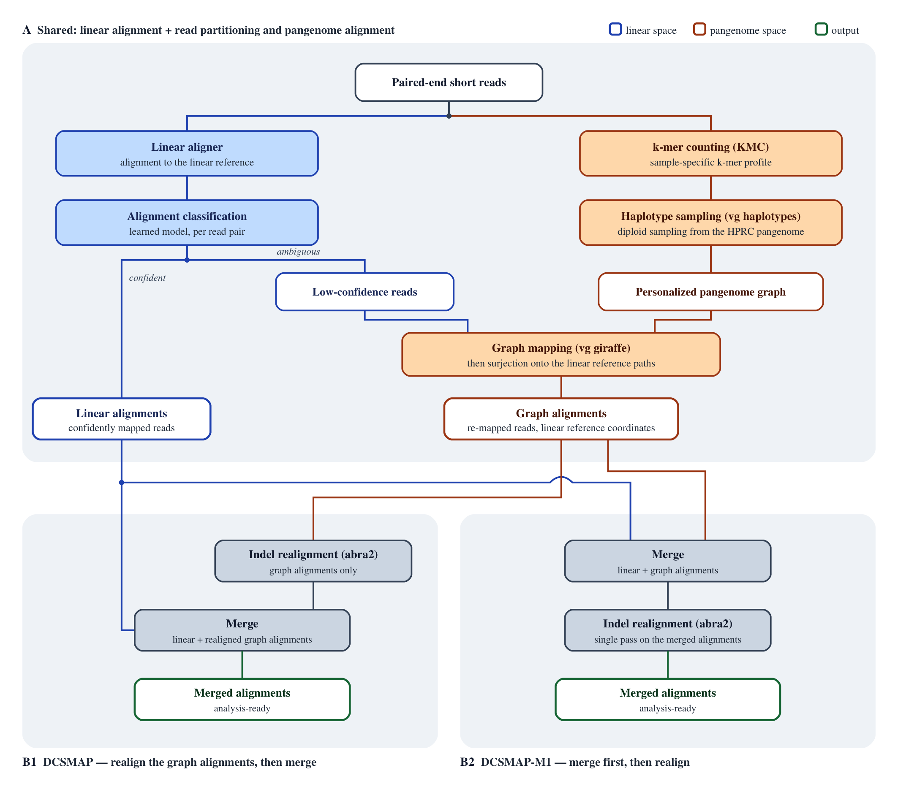

# dcsmap

`dcsmap` 是 DCSTools 的一部分，是一个快速、高精度的泛基因组感知（pangenome-aware）reads 比对工具。它采用混合比对策略，结合线性参考比对与泛基因组图比对。与 vg 工具集相比，`dcsmap` 在使用相同的下游 DeepVariant 变异检测流程时，比对速度提升 2.5 倍（在 32 核 128GB 服务器上从 ~5.5 小时降至 ~2.17 小时），同时 SNP/Indel 错误减少 7–12%。它使用机器学习模型从线性比对结果中识别低置信度比对，再用 vg giraffe 对这些 reads 重新比对，在提升比对精度的同时避免了对所有 reads 进行图比对的高昂计算开销。`dcsmap` 集成了优化版的 vg 工具集和 ABRA2，以实现高效的 haplotype 采样、图比对和 indel 重比对。

## 编译

```bash
mkdir build && cd build
cmake ..
make -j
```

二进制文件 `dcsmap` 输出到 `build/`。它采用**纯静态链接**（`-static`），因此没有运行时共享库依赖，可拷贝到任意具有相同硬件架构的Linux机器上运行。

### 示例

```bash
dcsmap \
    --fq1  sample.R1.fastq.gz \
    --fq2  sample.R2.fastq.gz \
    --out-bam  /out/sample.bam \
    --ref-fasta  /data/hprc-v2.0-mc-grch38.ref.fasta \
    --gbz  /data/hprc-v2.0-mc-grch38.gbz \
    --hapl  /data/hprc-v2.0-mc-grch38.hapl \
    --graph-ref-contigs  /data/hprc-v2.0-mc-grch38.ref.pathnames \
    --extract-model  /data/extract.model \
    --sample-name HG002 \
    --threads 32
```

`dcsmap` 依赖 DCSTools 环境：它从包含 `libexec/` 和 `jar/` 子目录的工具根目录中调用 `vg`、`samtools`、`bwa-mem2`、`abra2.jar` 等工具，并需要 Java 8 运行 ABRA2。

- `--tools-root`：默认取 `dcsmap` 可执行文件所在目录的父目录（例如 `dcsmap` 位于 `<DCSTOOLS_HOME>/libexec/dcsmap` 时，默认值为 `<DCSTOOLS_HOME>`）。若将 `dcsmap` 放在其他位置，请设置 `DCSTOOLS_HOME` 环境变量或显式传入 `--tools-root`。`--tools-root` 的优先级高于 `DCSTOOLS_HOME`。
- `--java-home`：默认读取 `JAVA_HOME` 环境变量，且必须指向 Java 8 安装目录（ABRA2 需要）。可显式传入 `--java-home` 按次覆盖。

```bash
# 可选：使用环境变量代替命令行参数
export DCSTOOLS_HOME=/path/to/dcstools
export JAVA_HOME=/path/to/jdk8
export PATH="${DCSTOOLS_HOME}/libexec:${PATH}"
```

**图和线性参考输入**

- `--gbz`：从 [HPRC 图谱](#hprc-图谱)下载 HPRC minigraph-cactus gbz 图。
- `--hapl`、`--graph-ref-contigs`（`<prefix>.ref.pathnames`）以及 `--ref-fasta`（`<prefix>.ref.fasta` + `.fai` + `.dict`）：三者均由 `scripts/build_hapl_fasta.sh` 从 gbz 一并生成（见[索引构建](#索引构建)步骤 1）。
- `linear_align_extract` 使用的 bwa-mem2 索引文件（`.0123`、`.amb`、`.ann`、`.bwt.2bit.64`、`.pac`）在 `--ref-fasta` 旁查找；使用 `bwa-mem2 index` 构建（见[索引构建](#索引构建)步骤 2）。
- `--extract-model`：`extract-bam` 用于标记低置信度线性比对以进行图重比对的机器学习模型。从 DCSTools 发行版获取（`$DCSTOOLS_HOME/share/dcsmap/extract.model` 或类似路径）。

## 用法

```
Program: dcsmap
version: 1.0.1

Usage: dcsmap [-option]

Required:
  --fq1 <file>                          输入 read1 fastq 路径
  --fq2 <file>                          输入 read2 fastq 路径
  --out-bam <file>                      输出 bam 路径（工作目录默认为其所在目录）
  --ref-fasta <file>                    参考 fasta 路径（需含 .fai + .dict + 比对器索引）
  --gbz <file>                          vg gbz 图路径
  --hapl <file>                         vg hapl 索引路径
  --graph-ref-contigs <file>            vg ref-paths 文件
  --extract-model <file>                extract-bam 模型文件

Options:
  --sample-name <str>                   样本名（默认：SAMPLE）
  --platform <str>                      测序平台（默认：DNBSEQ）
  --threads <int>                       使用的线程数（默认：32）
  --mode <str>                          工作流模式（默认：dcsmap）
                                        可选值：{dcsmap, dcsmap-m1}
  --tools-root <dir>                    工具根目录（libexec + jar）
                                        默认：DCSTOOLS_HOME 环境变量或可执行文件父目录
  --java-home <dir>                     JAVA home（须为 Java 8）
                                        默认：JAVA_HOME 环境变量
  --work-dir <dir>                      工作目录（默认：out-bam-dir/work.XXXXXX）
  --parallel <bool>                     linear_align_extract 与 vg_haplotype 并行运行（默认：true）
                                        设为 false 时先运行 vg_haplotype，再运行 linear_align_extract
  --clean <bool>                        成功后清理工作目录，保留 command.sh/logs/rc（默认：true）
  -h, --help                            显示帮助信息
  --version                             显示版本信息
```

## 工作流



### dcsmap 模式

- `linear_align_extract` 与 `vg_haplotype` 默认**并行**运行
  （`--parallel true`）。设为 `--parallel false` 时，先运行 `vg_haplotype`，
  再运行 `linear_align_extract`。
- `realign` 对 giraffe BAM 运行 ABRA2。
- `merge_bams` 将 ABRA2 BAM 与线性 not-extract BAM 合并为最终的 `--out-bam`。

### dcsmap-m1 模式

- `merge_bams` 合并线性 not-extract BAM 与 giraffe BAM。
- `realign` 对合并后的 BAM 运行 ABRA2，生成最终的 `--out-bam`。

### 任务

| 任务                  | 描述                                               |
|-----------------------|----------------------------------------------------|
| `linear_align_extract`| BWA-MEM2 比对 + extract-bam（提取 fastq + not-extract bam） |
| `vg_haplotype`        | vg haplotype 采样（生成 personalized-gbz、dist、min、zipcodes） |
| `vg_giraffe`          | 对提取的 fastq 进行 vg giraffe 比对                |
| `merge_bams`          | 合并 BAM（samtools merge）                          |
| `realign`             | ABRA2 重比对                                        |

## 工作目录

- 默认：`<dirname(--out-bam)>/work.XXXXXX`（使用 `mktemp` 创建）。
- 可通过 `--work-dir` 覆盖。
- 每个任务在独立子目录中运行：`<work_root>/task-<name>`。
- 每个任务输出 `command.sh`、`command.sh.log.o`、`command.sh.log.e` 和
  `command.sh.rc`。
- 成功后，若 `--clean true`（默认），中间文件会被删除，但
  `command.sh`、日志和 rc 文件会保留，便于追溯。

## HPRC 图谱

dcsmap 使用来自
[人类泛基因组参考联盟（HPRC）](https://humanpangenome.org/) 的
minigraph-cactus (mc) 泛基因组图。从下方 S3 URL 下载对应参考坐标系的
gbz 图。完整列表见 `data/hprc_graph_urls.tsv`。

| 坐标系 | 版本 | 大小 | URL |
|--------|------|------|-----|
| GRCh38 | v2 | 5.4 GB | https://s3-us-west-2.amazonaws.com/human-pangenomics/pangenomes/freeze/release2/minigraph-cactus/v2.0/hprc-v2.0-mc-grch38/hprc-v2.0-mc-grch38.gbz |
| CHM13 | v2 | 5.7 GB | https://s3-us-west-2.amazonaws.com/human-pangenomics/pangenomes/freeze/release2/minigraph-cactus/v2.0/hprc-v2.0-mc-chm13/hprc-v2.0-mc-chm13.gbz |

> **注：** 其他版本（v1.1、v2-eval）及 filtered (d46) 图谱见 `data/hprc_graph_urls.tsv`。

## 索引构建

dcsmap 需要两套索引：vg 图侧索引（hapl、ref fasta、pathnames）和 bwa-mem2 线性侧索引。分两步构建：

### 1. 构建 vg 图索引（scripts/build_hapl_fasta.sh）

从 vg gbz 图生成 vg hapl 索引、参考 fasta（+ .fai / .dict）和 ref pathnames 文件。从环境变量读取 `DCSTOOLS_HOME`，并期望 `vg`、`samtools` 位于 `$DCSTOOLS_HOME/libexec`。

```
用法: build_hapl_fasta.sh <gbz> <ref_path> [ref_dict] [out_prefix]

  <gbz>        vg gbz 图，例如 hprc-v2.0-mc-grch38.gbz
  <ref_path>   图中的参考路径前缀，例如 GRCh38 或 CHM13
  [ref_dict]   线性参考的 SAM dict（可选）
               若提供，contig 按 dict 的 @SQ 条目排序；
               否则按自然染色体顺序：chr1..chr22, chrX, chrY, chrM，然后其余。
               GRCh38 可使用本项目内置的
               data/GCA_000001405.15_GRCh38_no_alt_analysis_set.fna.dict
  [out_prefix] 输出路径前缀（默认：<gbz_dir>/<gbz_basename_without_.gbz>，
               即输出文件写入输入 gbz 同级目录）

输出:
  <prefix>.ref.fasta / .ref.fasta.fai / .ref.fasta.dict
  <prefix>.ref.pathnames
  <prefix>.hapl  (+ .snarls / .xg / .ri / .dist)
```

设置 `SKIP_INDEX=1` 可跳过 snarls/xg/ri/dist/hapl 构建（仅用于测试
fasta + pathnames 生成）。

1) GRCh38 线性参考坐标系
```bash
export DCSTOOLS_HOME=/path/to/dcstools
scripts/build_hapl_fasta.sh /data/hprc-v2.0-mc-grch38.gbz GRCh38 \
    data/GCA_000001405.15_GRCh38_no_alt_analysis_set.fna.dict
# 输出写入 /data/hprc-v2.0-mc-grch38.*（与输入 gbz 同级）
```

2) CHM13 T2T 线性参考坐标系
```bash
export DCSTOOLS_HOME=/path/to/dcstools
scripts/build_hapl_fasta.sh /data/hprc-v2.0-mc-chm13.gbz CHM13
# 输出写入 /data/hprc-v2.0-mc-chm13.*（与输入 gbz 同级）
# （无需 ref_dict —— CHM13 仅含 chr1-22/X/Y/M，使用自然顺序）
```

**构建 vg hapl 索引资源消耗**

基于 HPRC v2 GRCh38 Default 图（`hprc-v2.0-mc-grch38.gbz`，5.4 GB）实测。

| 步骤 | 命令 | 墙钟时间 | CPU% | 峰值 RSS | 产出大小 |
|------|------|---------|------|---------|---------|
| fasta + pathnames | `vg paths` / `samtools faidx` / `dict` | ~2m 20s | — | ~3 GB | 3.0 GB |
| snarls | `vg snarls` | 29m 51s | 7098% | 67.8 GB | 215 MB |
| xg | `vg convert -x --drop-haplotypes` | 9m 58s | 222% | 36.8 GB | 8.4 GB |
| ri | `vg gbwt -Z -r` | 3m 28s | 6085% | 46.4 GB | 9.5 GB |
| dist | `vg index -j` | 1h 00m | 96% | **262 GB** | **105.5 GB** |
| hapl | `vg haplotypes -H` | 1h 53m | 1078% | 63.9 GB | 19.9 GB |
| **合计** | | **~3h 40m** | — | — | **~148 GB** |

> **注：** `vg index -j`（dist）是瓶颈——单线程，~262 GB 峰值内存，~105 GB 产出（占总产出 71%）。

建议配置：32+ 核，300 GB 内存，300 GB SSD（300 GB 内存下限由 `vg index -j` dist 的 ~262 GB RSS 决定）。

### 2. 构建 bwa-mem2 索引

`dcsmap` 的线性比对器（bwa-mem2）在 `--ref-fasta` 路径旁查找其索引文件
（`.0123`、`.amb`、`.ann`、`.bwt.2bit.64`、`.pac`）。从步骤 1 生成的
`<prefix>.ref.fasta` 构建：

```bash
bwa-mem2 index <prefix>.ref.fasta
```

这会将索引文件写入 fasta 旁。`.fai` 和 `.dict` 已在步骤 1 中生成。

**bwa-mem2 索引资源消耗**

基于同一 GRCh38 参考 fasta（`hprc-v2.0-mc-grch38.ref.fasta`，3.0 GB）实测：

| 步骤 | 墙钟时间 | CPU% | 峰值 RSS | 产出大小 |
|------|---------|------|---------|---------|
| `bwa-mem2 index` | 16m 51s | 99% | 69.3 GB | 16.9 GB |

产出明细：`.bwt.2bit.64`（9.4 GB）、`.0123`（5.8 GB）、`.pac`（738 MB）、`.amb` / `.ann`（< 30 KB）。

建议配置：2+ 核，128 GB 内存，50 GB SSD（`bwa-mem2 index` 的 ~70 GB 峰值 RSS 决定了内存需求）。

## 许可证

`dcsmap` 工作流（本项目）采用 **BSD 2-Clause 许可证**发布。全文见
`LICENSE` 文件。

`dcsmap` 是 **DCSTools** 的一部分，DCSTools 为**商业授权软件**。使用、再分发
或修改内置的 DCSTools 组件（包括 `extract-bam`）需从 DCSTools 版权方获取
有效商业许可。DCSTools 组件本身不授予任何开源许可。请联系 DCSTools 维护者
获取授权条款与购买方式。

`dcsmap` 工作流还内置并调用了若干第三方开源工具，各自遵循其自身的许可证。
用户在再分发或运行 `dcsmap` 时须遵守下表所列各项许可证条款。

| 工具 | 使用者 | 许可证 |
|------|--------|--------|
| extract-bam | `linear_align_extract` | **商业授权（DCSTools）** |
| vg | `vg_haplotype`、`vg_giraffe` | MIT |
| samtools / htslib | `linear_align_extract`、`merge_bams` | MIT/BSD |
| bwa-mem2 | `linear_align_extract` | MIT |
| ABRA2 | `realign` | MIT |
| KMC | `extract-bam` k-mer 计数 | GPL-3.0 |
