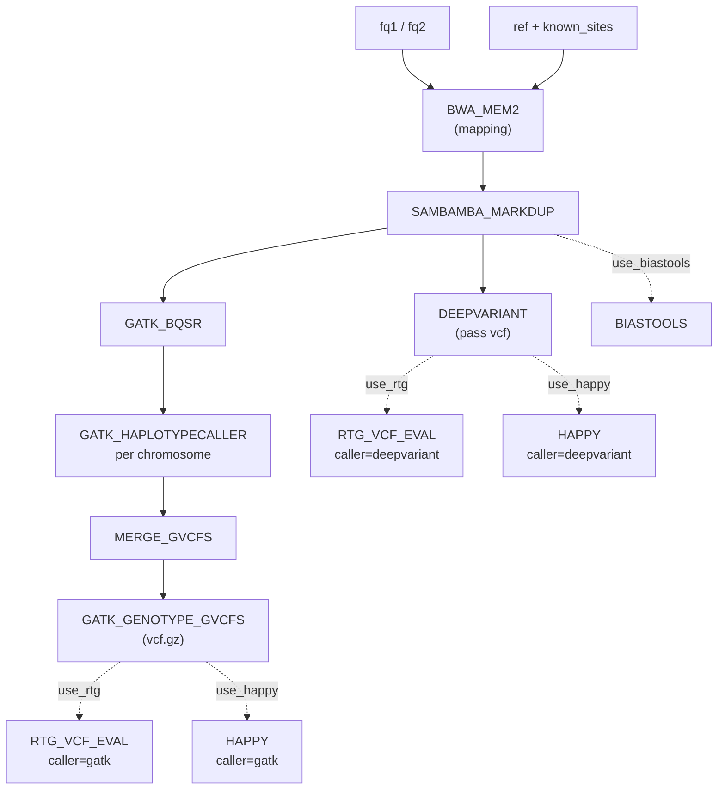
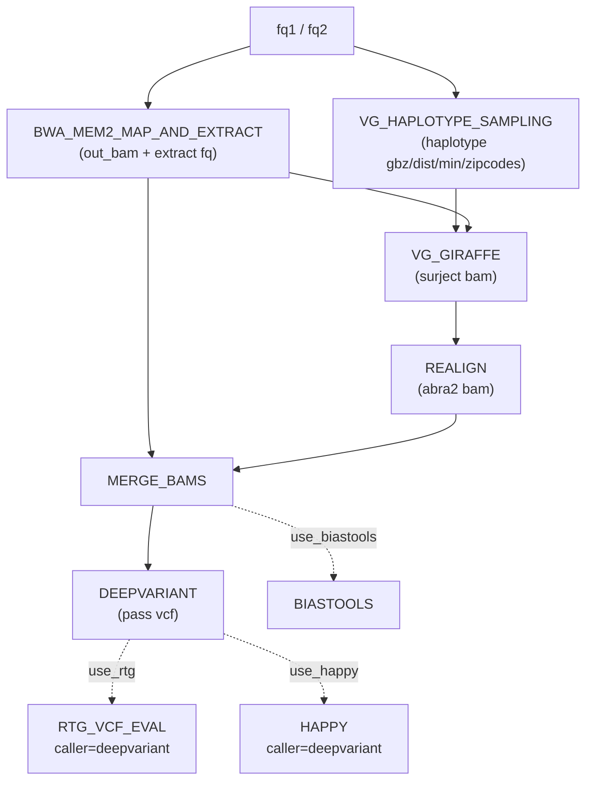
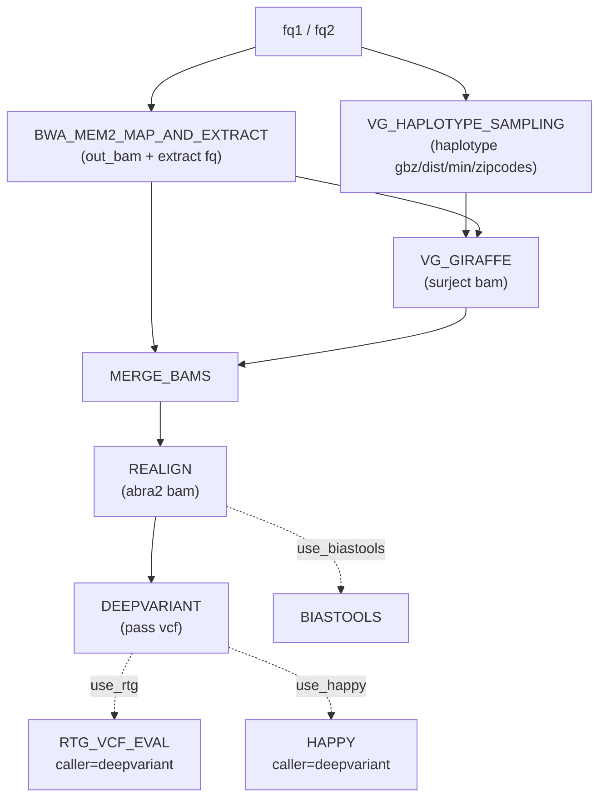
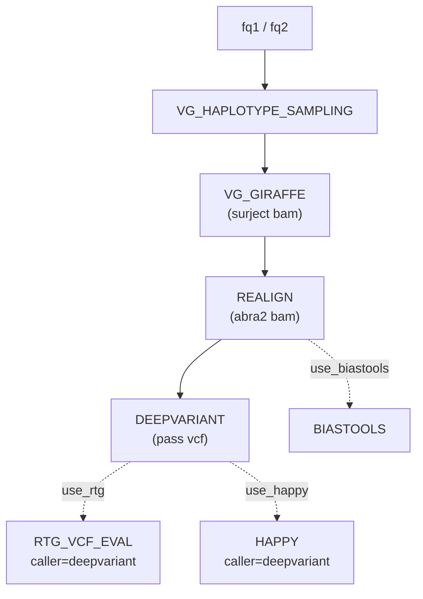
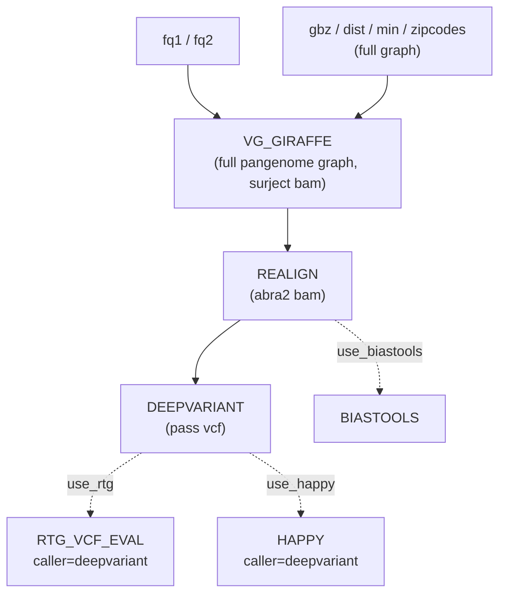

# panaligner Nextflow workflows

Five germline variant-calling & benchmarking pipelines implemented with
Nextflow DSL2 and shared modules under `modules/`.

| Workflow | Entry script | Aligner / mapper | Caller(s) |
|---|---|---|---|
| BWA-MEM2 | `bwa-mem2.nf` | BWA-MEM2 + sambamba markdup + GATK BQSR | GATK HaplotypeCaller/GenotypeGVCFs and/or DeepVariant |
| DCSMAP | `dcsmap.nf` | BWA-MEM2 map+extract → VG haplotype sampling → VG Giraffe → realign → merge | DeepVariant |
| DCSMAP-M1 | `dcsmap-m1.nf` | Same as DCSMAP, but merge BWA-MEM2 + VG Giraffe BAMs first, then realign once | DeepVariant |
| VG-Giraffe Diploid | `vg-giraffe-diploid.nf` | VG haplotype sampling → VG Giraffe (per-sample subgraph) → realign | DeepVariant |
| VG-Giraffe HPRC | `vg-giraffe-hprc.nf` | VG Giraffe directly on the full input pangenome graph (no haplotype sampling) → realign | DeepVariant |

All five workflows share the same optional benchmarking steps (RTG VCF eval,
hap.py, biastools) controlled by parameter switches, and publish logs/scripts
(`.command.sh`, `.command.log`) under a unified `<outdir>/logs/<task_id>/`
tree.

VG Giraffe mapping and abra2 indel realignment are implemented as two
separate, reusable modules:

| Module | Process | Description |
|---|---|---|
| `modules/vg_giraffe.nf` | `VG_GIRAFFE` | Maps reads with `vg giraffe` onto a gbz/dist/min/zipcodes graph, surjects to the reference paths. Outputs the surject BAM only (no realignment). |
| `modules/realign.nf` | `REALIGN` | Generic abra2 indel realignment (GATK `RealignerTargetCreator` + `abra2`) on any input BAM. Used on the VG Giraffe surject BAM directly (DCSMAP, VG-Giraffe Diploid/HPRC) or on a merged BAM (DCSMAP-M1). |

Splitting these lets DCSMAP-M1 merge the BWA-MEM2 and VG Giraffe BAMs
*before* realignment (a single `REALIGN` pass on the merged BAM) instead of
realigning the VG Giraffe BAM and then merging (DCSMAP's order).

## Quick start

```bash
# 1. install nextflow (requires Java 11+)
#    see https://www.nextflow.io/docs/latest/install.html
# 2. copy a config template and edit the parameters
cp config/bwa-mem2.config my-bwa.config
$EDITOR my-bwa.config          # point inputs / tools / containers at your data
# 3. run from the nextflow/ directory
nextflow run bwa-mem2.nf -c my-bwa.config -work-dir work
```

Each workflow is launched the same way, swapping the entry script and config:

```bash
nextflow run dcsmap.nf              -c config/dcsmap.config              -work-dir work
nextflow run dcsmap-m1.nf           -c config/dcsmap-m1.config           -work-dir work
nextflow run vg-giraffe-diploid.nf  -c config/vg-giraffe-diploid.config  -work-dir work
nextflow run vg-giraffe-hprc.nf     -c config/vg-giraffe-hprc.config     -work-dir work
```

Configuration templates live in `config/`:

```
config/
├── bwa-mem2.config
├── dcsmap.config
├── dcsmap-m1.config
├── vg-giraffe-diploid.config
└── vg-giraffe-hprc.config
```

Edit the relative paths in the template (fastq, reference, vg graph files,
Singularity images, tools, benchmark VCFs) to match your dataset. Any
parameter in the config can also be overridden on the command line, e.g.
`-params-file` or `--use_deepvariant false`.

> Tip: keep `-work-dir work` outside `<outdir>` (set by `params.outdir`) so the
> work directory and the published results do not collide.

## Common parameters

Parameters shared by all workflows.

| Parameter | Default | Description |
|---|---|---|
| `fq1` / `fq2` | `null` (required) | Paired-end FASTQ (gz allowed). |
| `sample_name` / `sample_id` | `SAMPLE` | Sample label used in output filenames. |
| `platform` | `Illumina` | Read-group platform. |
| `threads` | 32 / 16 | Default CPU count per process. |
| `ref_fasta` / `ref` | `null` (required) | Reference FASTA (with `.fai` + `.dict`). |
| `outdir` | `./results` | Published-results root. |
| `publish_mode` | `link` / `copy` | Nextflow publish mode. |
| `bind_path` | `''` | Data root bound into Singularity containers. |
| `deepvariant_sif` | `null` (required) | DeepVariant Singularity image. |
| `disable_small_model` | `false` | Disable DeepVariant small model. |
| `use_rtg` / `use_happy` / `use_biastools` | `false` | Enable benchmarking steps. |
| `rtg_sif`, `rtg_tag`, `giab_version`, `giab_stratify_version` | — | RTG VCF-eval inputs. |
| `happy_home`, `happy_sif`, `happy_ref` | `null` | hap.py inputs (required when `use_happy=true`). |
| `biastools_bin`, `biastools_tag`, `biastools_depth` | — | biastools inputs. |

| `publish_abra2_bam` | `false` | Publish the `REALIGN` abra2 BAM to `<outdir>/giraffe/` (DCSMAP, VG-Giraffe Diploid/HPRC) or `<outdir>/merged_realign/` (DCSMAP-M1). |
| `publish_merged_bam` | `true` (DCSMAP) / `false` (DCSMAP-M1) | Publish the `MERGE_BAMS` merged BAM to `<outdir>`. On by default for DCSMAP (merged BAM is the final output); off by default for DCSMAP-M1 (merged BAM is only an intermediate input to `REALIGN`, whose abra2 BAM is the final output — controlled by `publish_abra2_bam`). |
| `use_gkl` | `true` | Pass `--gkl` to `abra2` in the `REALIGN` step (Intel GKL-accelerated realignment). Set `false` to disable. |

DCSMAP, DCSMAP-M1 and VG-Giraffe Diploid additionally require vg graph +
haplotype sampling resources (VG Giraffe maps onto a per-sample
haplotype-sampled subgraph):

| Parameter | Description |
|---|---|
| `gbz` | VG `.gbz` graph (full pangenome, used as input to haplotype sampling). |
| `hapl` | VG `.hapl` haplotype file. |
| `ref_contigs` | Reference path names file. |
| `tools_root` / `java_home` | VG / JDK tool roots. |
| `extract_model` (DCSMAP / DCSMAP-M1 only) | XGBoost model for the BWA-MEM2 extract step. |

VG-Giraffe HPRC skips haplotype sampling and maps directly onto the full
input pangenome graph, so it requires the graph's own `dist`/`min`/`zipcodes`
indices instead of `hapl`:

| Parameter | Description |
|---|---|
| `gbz` | VG `.gbz` graph (full pangenome). |
| `dist` | VG `.dist` distance index of the full graph. |
| `min` | VG `.min` minimizer index of the full graph. |
| `zipcodes` | VG `.zipcodes` index of the full graph. |
| `ref_contigs` | Reference path names file. |
| `tools_root` / `java_home` | VG / JDK tool roots. |

`gbz`/`dist`/`min`/`zipcodes` must all describe the same full graph. If
`min`/`zipcodes` do not exist yet, build them once with:

```bash
vg minimizer -p -t <threads> -k 29 -w 11 --weighted --save-memory \
    -o <graph>.min -z <graph>.zipcodes -d <graph>.dist <graph>.gbz
```

BWA-MEM2 additionally exposes GATK-specific parameters:

| Parameter | Default | Description |
|---|---|---|
| `use_gatk` | `true` | Enable the GATK HaplotypeCaller → GenotypeGVCFs path. |
| `use_deepvariant` | `false` | Enable the DeepVariant path. |
| `gatk` | `gatk` | Path to the GATK launcher. |
| `known_sites` | `null` (required when `use_gatk=true`) | Comma-separated known-sites VCFs for BQSR. |

## DAG

### BWA-MEM2 (`bwa-mem2.nf`)



### DCSMAP (`dcsmap.nf`)



Realigns the VG Giraffe surject BAM (abra2) first, then merges it with the
BWA-MEM2 BAM.

### DCSMAP-M1 (`dcsmap-m1.nf`)



Merges the BWA-MEM2 BAM with the VG Giraffe surject BAM first, then runs a
single `REALIGN` (abra2) pass on the merged BAM. This is the only difference
from `dcsmap.nf`.

### VG-Giraffe Diploid (`vg-giraffe-diploid.nf`)



### VG-Giraffe HPRC (`vg-giraffe-hprc.nf`)



No `VG_HAPLOTYPE_SAMPLING` step: reads are mapped directly onto the full
input pangenome graph rather than a per-sample haplotype-sampled subgraph.

Dashed edges are conditional on the corresponding `use_*` switch being `true`.

## Output layout

All results are written under `params.outdir` (default `./results`).

### BWA-MEM2

```
<outdir>/
├── mapping/                     # BWA-MEM2 sorted BAM + BAI
├── markdup/                     # sambamba markdup BAM + BAI
├── gatk/
│   ├── bqsr/                    # BQSR-recalibrated BAM
│   ├── haplotypecaller/
│   │   ├── per_chrom/           # per-chromosome GVCF (HaplotypeCaller)
│   │   └── <sample>.g.vcf.gz    # merged GVCF
│   └── genotype/                # GenotypeGVCFs final VCF (+ .tbi)
├── deepvariant/                 # DeepVariant VCF (+ .tbi), PASS-filtered
├── benchmark/
│   ├── gatk/
│   │   ├── rtg/                 # RTG VCF eval (gatk)
│   │   └── happy/               # hap.py output (gatk)
│   └── deepvariant/
│       ├── rtg/                 # RTG VCF eval (deepvariant)
│       └── happy/               # hap.py output (deepvariant)
├── biastools/                   # biastools mapping-bias analysis (single run)
├── logs/                        # unified logs / scripts (see below)
└── pipeline_info/               # timeline / report / trace / dag
```

### DCSMAP / VG-Giraffe Diploid / VG-Giraffe HPRC

```
<outdir>/
├── deepvariant/                 # DeepVariant VCF (+ .tbi), PASS-filtered
├── giraffe/                     # REALIGN abra2 BAM (+ .bai), if publish_abra2_bam=true
├── *.merged.sort.bam*           # merged BAM (DCSMAP only), if publish_merged_bam=true (default true)
├── benchmark/
│   └── deepvariant/
│       ├── rtg/                 # RTG VCF eval
│       └── happy/               # hap.py output
├── biastools/                   # biastools mapping-bias analysis (single run)
├── logs/                        # unified logs / scripts (see below)
└── pipeline_info/               # timeline / report / trace / dag
```

### DCSMAP-M1

Same layout, except the merged BAM is only a pre-realign intermediate (fed
into a single `REALIGN` pass) and is **not** published by default. The final
analysis-ready BAM is the abra2 BAM published under `merged_realign/` instead
of `giraffe/` (reflecting that `REALIGN` runs on the merged BAM, not the VG
Giraffe BAM alone):

```
<outdir>/
├── deepvariant/                 # DeepVariant VCF (+ .tbi), PASS-filtered
├── merged_realign/              # REALIGN abra2 BAM (+ .bai) on the merged BAM, if publish_abra2_bam=true
├── *.merged.sort.bam*           # merged BAM (BWA-MEM2 + VG Giraffe, pre-realign), only if publish_merged_bam=true
├── benchmark/
│   └── deepvariant/
│       ├── rtg/                 # RTG VCF eval
│       └── happy/               # hap.py output
├── biastools/                   # biastools mapping-bias analysis (single run)
├── logs/                        # unified logs / scripts (see below)
└── pipeline_info/               # timeline / report / trace / dag
```

### Unified logs

Every task publishes `.command.sh` and `.command.log` under:

```
<outdir>/logs/<task_id>/
```

`<task_id>` keeps logs unique for processes invoked more than once:

| Process | `<task_id>` |
|---|---|
| Single-run tasks (BWA_MEM2, SAMBAMBA_MARKDUP, DEEPVARIANT, ...) | `<process>` |
| `GATK_HAPLOTYPECALLER` (per chromosome) | `<process>/<chrom>` |
| `RTG_VCF_EVAL` / `HAPPY` (per caller) | `<process>/<caller>` |

## Resuming

Nextflow caches completed tasks in `-work-dir`. Re-run with `-resume` to skip
cached tasks:

```bash
nextflow run bwa-mem2.nf -c my-bwa.config -work-dir work -resume
```

## Notes

- Singularity-based steps (DeepVariant, RTG, hap.py) bind `params.bind_path`
  (the data root) into the container with `-B`; keep your inputs under that
  root.
- BWA-MEM2's GATK path emits the raw GenotypeGVCFs VCF (no PASS filtering);
  downstream benchmarking uses it directly. DeepVariant's VCF is
  PASS-filtered before benchmarking.
- `GATK_HAPLOTYPECALLER` runs once per contig listed in the reference `.dict`;
  for references with many contigs most per-contig tasks finish quickly.
  `maxForks` in the config lets the empty intervals run concurrently.
